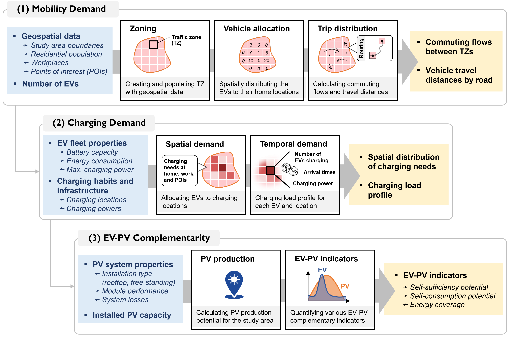

<center>
    
</center>

# EVPV-simulator
**The EVPV-simulator (Electric Vehicles - PhotoVoltaics Simulator) model is an open-source Python tool designed to calculate the spatio-temporal charging needs of privately-owned electric vehicles (EVs) and the potential for locally installed solar photovoltaics (PV) to meet these needs. The tool is primarily suited for modeling mobility demand in cities on weekdays, for which it enables the endogenous computation of daily mobility demand by combining georeferenced data with state-of-the-art spatial trip distribution models. For PV generation, it relies on the PVLib toolbox and integrates various PV installation archetypes (e.g., rooftop, free-standing PV, etc.)..**

Authors = Jeremy Dumoulin, Alejandro Pena-Bello, Noémie Jeannin, Nicolas Wyrsch

Lead institution = EPFL PV-LAB, Switzerland

Contact = jeremy.dumoulin@epfl.ch 

Langage = python 3 

> :bulb: This `README.md` provides a quick start guide for basic usage of the evpv-simulator model. Comprehensive documentation for detailed and advanced usage will soon be available on a [Read the Docs](https://readthedocs.org/) page. 

## Table of Contents

1. [Overview of the Model](#overview-of-the-model)
2. [Installation](#installation)
3. [Usage](#usage)
4. [Standout Features & Limitations](#standout-features-&-limitations)
5. [Scientific Publications](#scientific-publications)
6. [Acknowledgment](#acknowledgment)
7. [License](#license)

## Overview of the model

The **evpv-simulator** model has three main objectives and corresponding outputs (as shown in the Fig.1 , which illustrates the model’s key inputs, outputs, and processing steps):
1. **Mobility Demand Estimation.** Based on a user-defined region of interest and associated geospatial input data (population density, workplaces, points of interest (POIs), and number of EVs to simulate), the tool divides the region of intereste into traffic zones and assesses the mobility demand for commuting by simulating origin-destination for all EVs. 

2. **Charging Demand Analysis.** Using the mobility demand and basic properties of the EV fleet, the model calculates the spatial and temporal charging needs. Users define the preferred charging locations of EV users (at home, at work, or at POIs), typical arrival times, and the available charging powers at each locations. The output includes zone-level charging demand and load curves, assuming uncoordinated charging as a baseline charging strategy.

3. **EV-PV Complementarity.** Using PVLib and PVGIS weather data, the tool simulates the local hourly PV production over a given year. It then assesses how much of the EV charging demand can be met by solar energy, generating key performance indicators like self-sufficiency or self-consumption potentials.

<center>
	 
	<p><font size="-1">Fig. 1: evpv-simulator overview. Note that many optional input parameters and additionnal outputs are not shown.</font></p>
</center>

## Installation

### Getting python
Ensure Python is installed on your system. This project was developped with **Python 3.12**. Other versions may not be compatible.

If it is your first time with Python, we recommend installing python via [Miniconda](https://docs.conda.io/en/latest/miniconda.html). Many tutorials are available online to help you with this installation process (see for example [this one](https://www.youtube.com/watch?v=oHHbsMfyNR4)). During the installation, make sure to select "Add Miniconda to PATH".

> :thumbsup: Miniconda includes `conda`, which allows you to create a dedicated python environment for `evpv-simulator`. If not using conda, consider alternative environment managers like `venv`. Manual installation of all dependencies via `environment.yml`
is also possible but not recommended.

### Installation 
1. (Optional) Create a Conda environment with Python 3.12. As stated before, it is not mandatory but recommended to use a dedicated environment. Here an example with conda using an environment named *evpv-env*

```bash
$ conda create --name evpv-env python=3.12
$ conda activate evpv-env
```

2. Install evpv as a python package from the GitHub repository
```bash
$ pip install git+https://github.com/jeremydumoulin/evpv-simulator.git
```

## Usage

After installation, you can run the **EVPV model in command-line mode**. This is ideal for users who are not familiar with Python or who want to quickly conduct a simple case study.

First, create a configuration file by copying an existing example such as the [Addis Ababa config file](https://github.com/jeremydumoulin/evpv-simulator/tree/main/examples/Basic_AddisAbaba_ConfigFile). Update it with your own input values and ensure that all required geospatial input data is available (see the config file and `input/` folder for guidance).
> :bulb: We recommend starting with the Addis Ababa example to get familiar with the process.  
> :bulb: Need help in gathering the needed geospatial inputs? See the next section.

Once your config file is ready, open a terminal, activate your conda environment (optional), and run:
```bash
$ evpv
```
You’ll be prompted to enter the path to your config file:
```bash
$ Enter the path to the python configuration file: C:\Users\(...)\config.py
```
> :warning: Use absolute paths in the config file, or start the terminal in the same directory to use relative paths.

Here below an animation showing process for the Addis Ababa example:


### Where can I get the needed Geospatial Data?

To run the model, you will need the following four types of geospatial input data:

- **Region of interest**: A GeoJSON file defining the boundary of your study area. For most administrative regions, you can download this from the [GADM dataset](https://gadm.org/).

- **Residential population**: A `.tif` raster file showing population density, in the WGS84 coordinate system. We recommend using the [GHS-POP dataset](https://human-settlement.emergency.copernicus.eu/download.php?ds=pop) at the lowest available resolution.

- **List of workplaces**: A CSV file with the following columns: `name`, `latitude`, `longitude`, and `weight`. You can generate this manually from local data or automatically extract it from OpenStreetMap using the helper script in `scripts/extract_pois_from_osm.py`.

- **List of POIs (Points of Interest)**: Same format and process as for workplaces. Use the same script but with modified inputs.

### Using evpv classes in python scripts (advanced usage)

Advanced users can write custom Python scripts by importing and interacting with core classes from the `evpv/` module:

```python
from evpv.vehicle import Vehicle
from evpv.vehiclefleet import VehicleFleet
# etc.
```

All the classes are located in the `evpv/` folder, as shown in the project structure:

```bash
├── setup.py
├── README.md
├── evpv/
│   ├── vehicle.py
│   ├── vehiclefleet.py
│   ├── region.py
│   ├── mobilitysimulator.py
│   ├── chargingsimulator.py
│   ├── pvsimulator.py
│   ├── evpvsynergies.py
│   ├── evpv_cli.py
│   └── helpers.py
├── examples/
│   └── Basic_AddisAbaba_ConfigFile/
├── scripts/
│   └── extract_pois_from_osm.py
└── docs/
```

**Core Classes**  
- `Vehicle`: Defines a vehicle type.  
- `VehicleFleet`: Manages EV fleet data.  
- `Region`: Defines geospatial properties.  
- `MobilitySimulator`: Simulates trip generation and allocation.  
- `ChargingSimulator`: Estimates charging demand over time and space.  
- `PVSimulator`: Simulates solar energy production.  
- `EVPVSynergies`: Analyzes EV-PV interaction metrics.

**Utilities**  
- `evpv_cli.py`: Command-line interface (see [Usage](#usage)).  
- `helpers.py`: Internal utility functions.

## Standout Features & Limitations

### Main features
- :arrows_counterclockwise: **Calibration-free mobility demand model for home-to-work commuting**. Estimates commuting transport demand by modeling vehicle flows between origins (homes) and destinations (workplaces) using a calibration-free gravity model ([Lenormand et al.](https://doi.org/10.1016/j.jtrangeo.2015.12.008)). No local transport data required and OpenRouteService can be used for accurately evaluating road distances. 

- :convenience_store: **Mobility demand for other purposes**.Although focused on commuting, the model allows users to include additional weekday mobility (e.g., shopping, leisure) via an optional `km_per_capita_offset` parameter.

- :electric_plug: **Charging-decision modeling**. Uses a state-of-the-art model based on state-of-charge (SoC) thresholds to determine whether vehicles charge on a given day, following [Pareschi et al.](https://doi.org/10.1016/j.apenergy.2020.115318).

- :memo: **Flexible EV fleet and charging infrastructure**. Supports every possible user-defined scenario regarding the EV fleet properties and charging infrastructure to simulate, accounting also for a maximum charging power per vehicle.

- :bulb: **Smart charging ready**. Simulates uncontrolled ("dumb") charging by default. Includes a basic rule-based peak shaving algorithm that shifts charging within arrival–departure windows to smooth demand. Output can be used for more advanced smart charging strategies.

- :sunny: **PV system presets**. Easily generates PV production and EV–PV complementarity metrics for common PV system types (rooftop, ground-mounted, with or without tracking).


### Limitations 

- **Zoning**: Spatial resolution depends on traffic zone size, with no current downscaling. The gravity model hasn’t been validated for zones smaller than 5 km², and rectangular zones may not represent travel patterns accurately.

- **Trip purposes**: Only direct home-to-destination and back trips are modeled. Intermediate stops and non-commuting purposes (e.g., shopping, leisure) are not included.

- **Routing**: Relies on OpenRouteService for accurate distances, which requires an internet connection.

- **Weekdays only**: The model simulates mobility and charging only for weekdays, not weekends.

- **Zone attractiveness**: Zone attractiveness is based on the number of workplaces from OpenStreetMap, not the number of jobs. This may reduce accuracy in areas with uneven job distribution.

- **Weather data**: PV production relies on PVGIS weather data, which also requires an internet connection.

- **EV-PV as a closed system**: Assumes all PV energy is used only for EV charging, without accounting for other loads or infrastructure limitations.

### Planned features

- Adding more examples
- Create a readthedocs
- Make a contributing guide
- Write some unit tests 

## Scientific publications
[1] Jérémy Dumoulin et al. A modeling framework to support the electrification of private transport in African cities: a case study of Addis Ababa. arXiv preprint arXiv:2503.03671, 2025. [https://doi.org/10.48550/arXiv.2503.03671](https://doi.org/10.48550/arXiv.2503.03671). 

## Acknowledgment 
This project was supported by the HORIZON [OpenMod4Africa](https://openmod4africa.eu/) project (Grant number 101118123), with funding from the European Union and the State Secretariat for Education, Research and Innovation (SERI) for the Swiss partners. We also gratefully acknowledge the support of OpenMod4Africa partners for their contributions and collaboration.

## License

[GNU GENERAL PUBLIC LICENSE](https://www.gnu.org/licenses/gpl-3.0.html)
