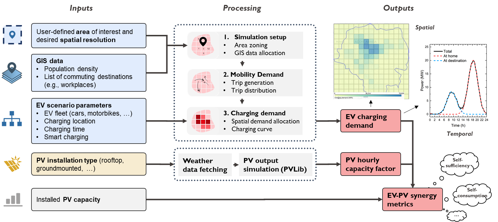

# EV-PV
**The EV-PV (Electric Vehicles - Photovoltaics) model is an open-source Python tool designed to calculate the charging needs of privately-owned electric vehicles (EVs), the potential for photovoltaic power generation (PV), and possible synergies between the two (self-sufficiency, self-consumption, ...) in a specific area. The tool primarily focuses on estimating the charging needs for daily commuting. It calculates the mobility demand for this purpose endogenously by combining georeferenced data with transport demand modeling.**

Authors = Jeremy Dumoulin, Alejandro Pena-Bello, Noémie Jeannin, Nicolas Wyrsch

Lead institution = EPFL PV-LAB, Switzerland

Contact = jeremy.dumoulin@epfl.ch 

Langage = python 3 

> :bulb: This `README.md` provides a quick start guide for basic usage of the EV-PV model. Comprehensive documentation for detailed and advanced usage will soon be available on a [Read the Docs](https://readthedocs.org/) page. In the meantime, you can refer to this file and explore the `/examples` folder, which includes a variety of examples, from basic to advanced use cases.

## Overview of the model

The EV-PV model has three main objectives and corresponding outputs (as shown in the following figure, which illustrates the model’s key inputs, outputs, and processing steps):
1. **Estimate the spatial and temporal charging demand for electric vehicles.** This is done by first calculating the mobility demand within the area of interest. To do so, the later is divided into sub-zones (zoning), and the passenger flows between these zones are estimated, focusing specifically on trips between home and the destinations people travel to for their daily commute (e.g., workplaces, park-and-ride facilities, universities, ...). Based on this, the user can input scenario parameters related to the electric vehicle fleet and the charging behavior to estimate the charging needs.
2. **Calculate the PV power production potential for the area of interest.** This can be done for different configurations (rooftop, ground-mounted, etc.) and relies on the PVLib toolbox. The output primarily includes an hourly capacity factor over a year, along with other standard PV metrics (performance ratio, production in W/m², etc.).
2. **Analyze potential synergies between EVs and PV energy.** This involves evaluating various indicators by combining the PV capacity factor with the EV charging curve for a given PV capacity.

<center>
	 
	<p><font size="-1">EV-PV Model overview. Note that many optional input parameters and additionnal outputs (e.g., mobility demand outputs such as daily distance travelled or total passenger-km) are not shown.</font></p>
</center>

## Installation

### Requirements
- **Python**: Ensure Python is installed on your system. 
- **Conda** (optional, but recommended): Use Conda for managing Python environments and dependencies. 
- **Open Route Service API key** (optional, but recommended to perform realistic road-based distance estimation): Sign up for an API key at [OpenRouteService](https://openrouteservice.org/sign-up/).

> :bulb: If you are new to python and conda environments, we recommand installing python and conda via the [Miniconda](https://docs.conda.io/en/latest/miniconda.html) distribution. During the installation, make sure to select "Add Miniconda to PATH" for ease of use.

> :thumbsdown: If you do not want to use conda, we strongly recommend using an other virtual environment manager (venv, ...). However, you can also manually install all the python dependencies (not recommended) using the list of required modules in the `environment.yml` file (Note that the code was developed and tested using python 3.12, so other python version might not work).

### Installation with conda
1. Clone the latest version of the code on GitHub on your local machine. If you are not familiar with git, you can also manually download the folder from GitHub and then run the code. However, you won't be able to contribute to the project.
```bash
$ git clone https://github.com/jeremydumoulin/evpv.git
```

2. Open an Anaconda prompt and create a new conda environment with the required dependencies. 
```bash
$ conda env create -f environment.yml -n your_environment_name
```

3. Activate the conda environment (assuming the environment is named `your_environment_name`). 
```bash
$ conda activate your_environment_name
```

## Project structure
```bash
├───environment.yml
├───LICENSE.md
├───README.md
├───doc/
├───evpv/
│   ├───chargingscenario.py
│   ├───evcalculator.py
│   ├───evpvsynergies.py
│   ├───helpers.py
│   ├───mobilitysim.py
│   └───pvcalculator.py
├───examples/
│   ├───input/
│   ├───output/
│   ├───00_basic_usage.py
│   └───...
└───scripts/
```  
### Available Modules
In the `evpv/` folder, you will find the following modules:

- **Core Classes** (required for any basic usage):
  - **EVCalculator**: Simulates the EV charging demand.
  - **PVCalculator**: Simulates the PV production potential.
  - **EVPVSynergies**: Calculates EV-PV synergy metrics based on the results from the other two classes.

- **Additional Classes** :
  - MobilitySim: Provides mobility demand simulations (for advanced usage).
  - ChargingScenario: Allows simulation of different charging scenarios (for advanced usage).
  - helpers.py: Contains various functions used internally by the other classes (internal use).

### Examples
In the `examples/` folder, you will find various examples illustrating basic and more advanced use cases. We recommend looking at the various scripts, starting with the more basic ones.

### Scripts
In the `scripts/` folder, you will find additionnal helpful scripts, notably a script to fetch georeferenced workplaces from OpenStreetMap.

## Usage

To run the code, create a new Python script and import the necessary modules from the `evpv/` folder.

### Basic Usage

For basic usage, you only need to import the three core classes:

```python
from evpv.evcalculator import EVCalculator
from evpv.pvcalculator import PVCalculator
from evpv.evpvsynergies import EVPVSynergies
```

**Description of Core Classes:**

- **EVCalculator**: EV charging demand simulation. 
- **PVCalculator**: PV production simulation.
- **EVPVSynergies**: EV-PV synergy metrics.

> :bulb: **Tip:** For a quick start, check the example scripts in the `examples/` folder. We recommend starting with the script `00_basic_usage.py`, which demonstrates how to use the three core classes with a minimal set of input parameters. Additionally, the files `01_evcalculator.py`, `02_pvcalculator.py`, and `03_evpvsynergies.py` show how to use the classes including also the optional parameters.

### Advanced Usage

For advanced usage, you can also import the `MobilitySim` and `ChargingScenario` classes. These classes provide greater control over the EV charging demand estimation by separating mobility demand simulation from charging scenario simulation. In contrast, the `EVCalculator` class performs both tasks in a single step. This can be particularly useful for running mobility demand simulations independently of the EV demand. For example, you can conduct multiple mobility simulations for different types of trips, such as home-to-work and home-to-study, and then aggregate the results to use them in a `ChargingScenario`.

> :bulb: **Info:** Under the hood, the `EVCalculator` class is simply a wrapper class facilitating the use of the `MobilitySim` and the `ChargingScenario` classes.

```python
from evpv.mobilitysim import MobilitySim
from evpv.chargingscenario import ChargingScenario
```


## Features

## Contributing

## Scientific publications

## Acknowledgment 
This project was supported by the HORIZON [OpenMod4Africa](https://openmod4africa.eu/) project (Grant number 101118123), with funding from the European Union and the State Secretariat for Education, Research and Innovation (SERI) for the Swiss partners. We also gratefully acknowledge the support of OpenMod4Africa partners for their contributions and collaboration.

## Good to know

## License

[MIT](https://choosealicense.com/licenses/mit/)
